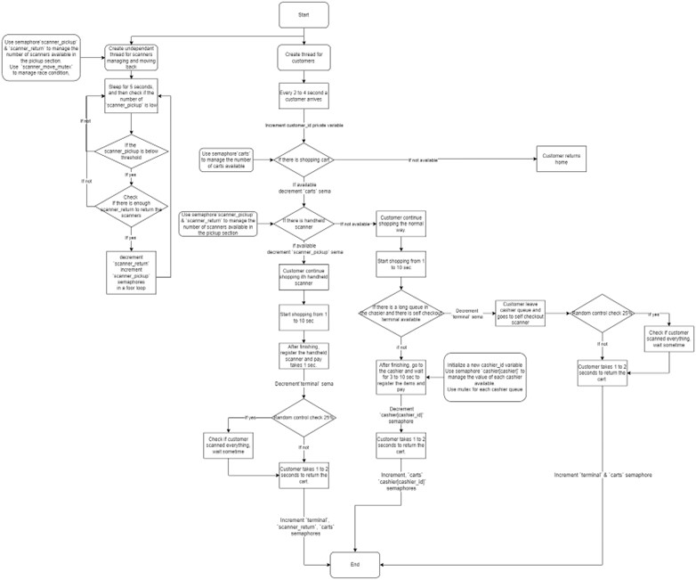
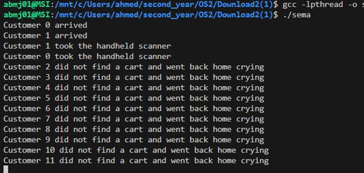
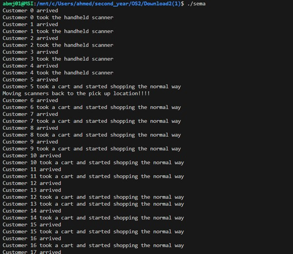
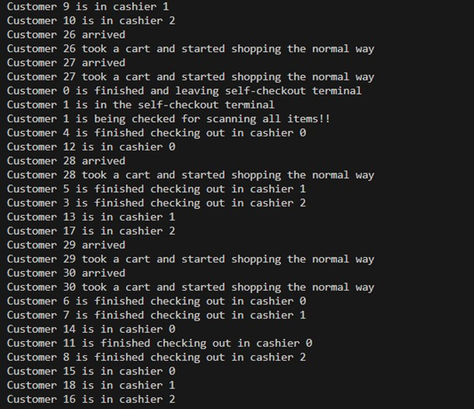
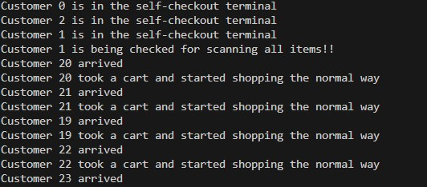
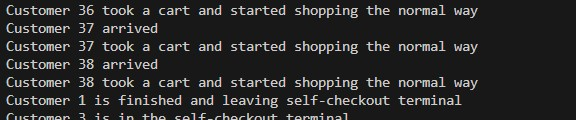
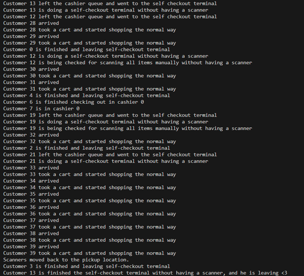
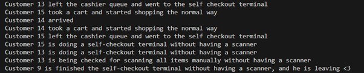
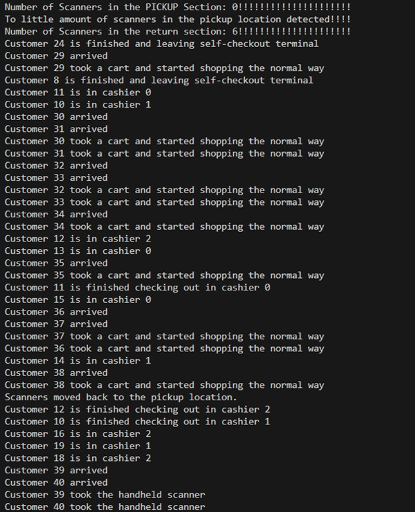

## Semaphore report and explanation

### Authour: Ahmed Al-Ganad

#### This document is the report for the Semaphore assignment. It covers the:

- Assignment description.
- Problem approach.
- Flowchart and brief explanation of the software.
- Software Tests with screenshots.

#### Assignment: 
The assignment is to print on the terminal by simulating supermarket activities using threads, semaphores, and mutexes ,For example:
- How many customers enters the supermarket.
- Did the customer find a shopping cart or not. 
- Did the customer chose to shop the normal way or with a self-scanner.
- How would the customer act if one of multiple cashiers has a long queue.
- If the customer have a self scanner would they go to the self checkout terminal or to the cashier depending on the length of the queue.
- Would customers checking out at a self-checkout terminal checked randomly.

#### Problem approach:
After reading tutorials and looking at a lot of videos in the
internet about semaphores, threads, and mutexes, also reading the documentation of important libraries such as
[semaphore.h] (https://www.man7.org/linux/man-pages/man0/semaphore.h.0p.html), and [pthread.h](https://www.man7.org/linux/man-pages/man7/pthreads.7.html) to help understand how to implement the software and to utilize
useful functions.
This approach helped me understand the concept behind the topic and to implement the
software of the semaphore assignment.
A flowchart will be provided in the next section to explain the software including semaphores,
mutexes, and threads used. After that explanation of the semaphores, mutexes, and functions
implemented will be present.

------------------------------------------------------------------------------

##### Schematics to describe the software:

##### Description of the semaphores used:

- `carts`: to manage the carts available.
- `terminal`: to manage the terminals available.
- `cashiers[CASHIERS]`: to manage each cashier available.
- `scanner_pickup`: to manage the value of the scanners available in the pickup
section.
- `scanner_return`: to manage the value of the scanners in the return section.

##### Description of the mutexes used:

- ` queue_mutex`: mutex to protect racing condition on the section where the lengths of
all cashier queues are checked and updated. It ensures that no other customer can
interfere while a customer is finding the shortest queue and updating the length of the
selected queue.
- `cashier_queue[CASHIERS]` : mutex to protect the racing condition for each cashier
queue. It ensures that every customer can update the length of a certain cashier queue
at a certain time.
- ` scanner_move_mutex`: mutex to protect from racing condition to return the
scanners on the return section to the pickup section.

------------------------------------------------------------------------------

##### Description of the functions used:

- void *handle_customers_arrival(void* arg) : Function to handle the customer arrival, it
creates a thread `customer_thread` and join to the function handle_carts()
- void *handle_carts(void* arg) : Function to handle the carts availability using a
semaphore `cashier`, it creates a thread `customer_choice_thread` and joins it with
the following function handle_customer_choice()
- void *handle_customer_choice(void* arg): Function to handle the customer choice
between taking a handheld scanner for shopping the normal way, it uses the
scanner_pickup semaphore, and it create a thread either to
handle_self_checkout_shopping() func or handle_cashiers() func depending on the
availability of the scanner_pickup semaphore.
- void *handle_self_checkout_shopping(void* arg): Function for people with handheld
scanner to manage the shopping time and the self-checkout in the terminal, that uses
`terminal` semaphore, it also has a random check for scanning all items it also posts or
increment the `scanner_return` semaphore, the `terminal` semaphore, and the
`carts` semaphore after the customer finish shopping.
void *handle_cashiers(void* arg): Function to handle the cashiers queues, it uses 3
semaphores for 3 different cashiers `cashier[CASHIERS]` and uses a mutex
`queue_mutex` to prevent the race condition between customers(threads), it also uses
a mutex for each cashier `cashier_queue[CASHIERS]` it checks the condition if the
cahier queue is long and there is a terminal free if so it creates a thread
`self_checkout_thread` create a thread with
handle_self_checkout_for_people_without_scanner() func so that the user without hand
held can skip the cashier queue and go to the self-checkout terminal. If not, it posts
`cashier[cashier_id]` and the `carts` semaphores.
- void *handle_self_checkout_for_people_without_scanner(void* arg): Function to
handle people who skipped the cashier queue . This function is very similar to the
handle_self_checkout_shopping() function but without posting the `scanners`
semaphore.
- void *move_scanners(void *arg): Function that is responsible for returning the
scanners to the pickup place it's thread is created and initialized in the main function so
that it checks if there are scanners independently every 5 sec if there is low amount of
scanners in the pickup section and enough scanners in the return section it waits and then decrement the value of the `scanner_return` and post or increment the value of
the `scanner_pickup` in a for loop at once.
void wait_time(int min, int max): Function to sleep() between min and max
parameters.

------------------------------------------------------------------------------

#### Test conditions:
1) Customer leaves if there are not enough carts:
To test this: Decrease the number of carts to check:

 customer leaves no enough carts.

------------------------------------------------------------------------------

2) Customers choose between scanner if available or normal shopping:
To test this: Decrease the number of scanners and increase the number of carts:

 customer choose shopping the normal way if there is no scanners.

 ------------------------------------------------------------------------------

3) Customers that are doing shopping the normal way switch between cashiers if the
queue in a certain cashier is long.
To test this: Reduce the number of scanners and terminals; increase the number of carts:

customers choosing between different cashiers depending on the queue in each cashier.

------------------------------------------------------------------------------

4) Customer checking out in the terminal get control checked randomly:
To test this: Increase the number of scanners to see if there is customer that is going to get
control check:

customer 1 get checked normally and took more time to check out.

customer 1 checking out later.

------------------------------------------------------------------------------

5) Customer without handheld scanner can skip the cashier queue if the queue is long and
there is an available self-check terminal.
To test this: Increase the number of terminals and decrease the number of cashiers and
scanners:

customer 13 leaving the cahier queue and going to the self-checkout terminal.

------------------------------------------------------------------------------

6) Customers who skipped the cashier queue and went to self-checkout terminals also get
checked randomly:
To test this: Increase the number of terminals and decrease the number of cashiers, scanners,
the time taken to shop in the normal way, and the time taken to control check:

customer 13 is being control checked while not having a handheld scanner.

------------------------------------------------------------------------------

7) Handheld scanners return from the return section to the pickup section if the pickup
section scanners are below certain threshold and there are enough scanners in the
return section:
To test this: Decrease the time taken to shop with a handheld scanner, and decrease the selfcheckout time:

scanners returned and upcoming customers start getting handheld scanners.

Description of the previous image: As you can see in the beginning of the image the number of
scanners in the pickup location went to zero and there was 6 scanners already in the return
scanner section, so the scanners was moved successfully and you can see in the end of the
image that the upcoming customers took a handheld scanner.

Thant was the end of this document I hope you benefited from the content of this documentation and can easily now implement important concepts in computer science such as task management which includes semaphores, mutexes, and threads.